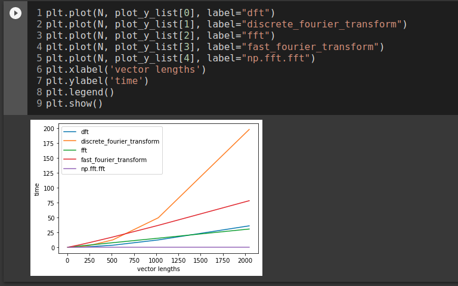

# DC_FFT
Fast Fourier Transform Benchmarking.

**List Number**: X 
**Discipline Subject**: Divide and Conquer 

## Students
|Number | Student |
| -- | -- |
| 17/0146251  |  João Lucas Zarbiélli |
| 19/0046945  |  Leonardo Michalski Miranda |

## Screenshot

## Video (pt-br, [download link](https://raw.githubusercontent.com/projeto-de-algoritmos/DC_FFT/main/assets/video.mp4))

## How to run
**Language**: Python  
**Frameworks**: Jupyter; NumPy.
Access the [notebook](http://colab.research.google.com/github/projeto-de-algoritmos/DC_FFT/blob/main/fft.ipynb) with Google Colab.

## References

Maklin, Cory - Fast Fourier Transform - 29/12/2019  
Disponivel em [aqui](https://towardsdatascience.com/fast-fourier-transform-937926e591cb)  
Acessado em: 08/04/2021  
